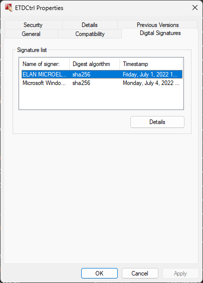
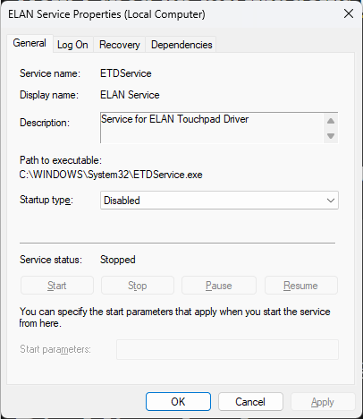

Title: How I sped up my windows laptop for nothing
Date: 2025-02-24
Category: Writeups
Tags: windows, drivers

Minding my own business checking for something in Task Manager I see a process I don't recognize bouncing across CPU usage. I kill the process and move on. But everything is snappier. Fast forward a week and I've tracked the exe down again. It's `C:\Windows\System32\ETDCtrl.exe`.

## What the hell is that

[Elan](https://www.emc.com.tw/emc/en/Products/Solution/TouchpadSolutions) makes touchpads. They also sign this paticular Lenovo OEM driver. I cannot figure out what the process does beyond claiming to process some gestures. Everything I use in Windows 11 works just fine if not faster without it.

## Disabling the slow

Elan thankfully will let you control if you want their non-configurable gesture platform.

* Open services.msc (Start -> Services or wir+r services.msc)
* open "ELAN Service"
* Statup type: Disabled.

